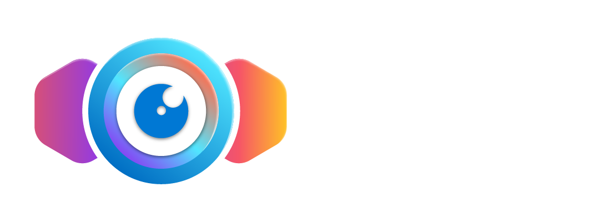

<h1 align="center">
  <picture>
    <source media="(prefers-color-scheme: light)" srcset="site/static/img/Retina-logo-horizontal-white.png">
    
  </picture>
</h1>

[](https://github.com/codespaces/new?hide_repo_select=true&ref=main&repo=746962176)

[![goreport][goreport-img]][goreport] ![GitHub release][release-img] [![retina-publish][godoc-badge]][godoc] ![license]

[![retina-test][retina-test-image-badge]][retina-test-image] [![retinash][retinash-badge]][retinash] [![retina-publish][retina-publish-badge]][retina-publish] ![retina-codeql-img][retina-codeql-badge] ![retina-golangci-lint-img][retina-golangci-lint-badge]

## Overview

Retina is a cloud-agnostic, open-source **Kubernetes network observability platform** that provides a **centralized hub for monitoring application health, network health, and security**. It provides actionable insights to cluster network administrators, cluster security administrators, and DevOps engineers navigating DevOps, SecOps, and compliance use cases.

Retina **collects customizable telemetry**, which can be exported to **multiple storage options** (such as Prometheus, Azure Monitor, and other vendors) and **visualized in a variety of ways** (like Grafana, Azure Log Analytics, and other vendors).

## Features

- **[eBPF](https://ebpf.io/what-is-ebpf#what-is-ebpf)-based** Network Observability platform for Kubernetes workloads.
- **On-Demand** and **Configurable**.
- Actionable, industry-standard **Prometheus metrics**.
- Streamlined **Packet Captures** for deep dives.
- **Cloud-agnostic**, supporting multiple OS (like Linux, Windows, Azure Linux).

## Why Retina?

Retina lets you **investigate network issues on-demand** and **continuously monitor your clusters**. For scenarios where Retina shines, see the intro docs [here](https://retina.sh/docs/Introduction/intro)

## Documentation

See [retina.sh](http://retina.sh) for documentation and examples.

## Capabilities

Retina has two major features:

- [Metrics](https://retina.sh/docs/Metrics/modes)
- [Captures](https://retina.sh/docs/Captures/overview)

### Metrics Quick Install Guide

Retina can be installed using the Helm chart from GHCR:

```bash
# Set the version to a specific version here or get latest version from GitHub API.
VERSION=$( curl -sL https://api.github.com/repos/microsoft/retina/releases/latest | jq -r .name)
helm upgrade --install retina oci://ghcr.io/microsoft/retina/charts/retina \
    --version $VERSION \
    --set image.tag=$VERSION \
    --set operator.tag=$VERSION \
    --set logLevel=info \
    --set enabledPlugin_linux="\[dropreason\,packetforward\,linuxutil\,dns\]"
```

Set the `version` and image `tag` arguments to the desired version, if different.

After Helm install, follow the steps for setting up [Prometheus](https://retina.sh/docs/Installation/prometheus) and [Grafana](https://retina.sh/docs/Installation/grafana) to configure metrics collection and visualization.

### Captures Quick Start Guide

#### Captures via CLI

The preferred way to install the Retina CLI using [Krew](https://krew.sigs.k8s.io/).

```bash
kubectl krew install retina
```

Other installation options are documented in [CLI Installation](https://retina.sh/docs/Installation/CLI).

Verify installation:

```bash
$ kubectl retina version
v0.0.4 # or latest version
```

To quickly start creating a capture:

```bash
kubectl retina capture create --name <my-capture> --namespace <my-namespace> --selector <app=my-app>
```

For further CLI documentation, see [Capture with Retina CLI](https://retina.sh/docs/Captures/cli).

#### Captures via CRD

Install Retina using Helm:

```bash
VERSION=$( curl -sL https://api.github.com/repos/microsoft/retina/releases/latest | jq -r .name)
helm upgrade --install retina oci://ghcr.io/microsoft/retina/charts/retina \
    --version $VERSION \
    --set image.tag=$VERSION \
    --set operator.tag=$VERSION \
    --set image.pullPolicy=Always \
    --set logLevel=info \
    --set os.windows=true \
    --set operator.enabled=true \
    --set operator.enableRetinaEndpoint=true \
    --skip-crds \
    --set enabledPlugin_linux="\[dropreason\,packetforward\,linuxutil\,dns\,packetparser\]"
```

Then follow steps in [Capture CRD](https://retina.sh/docs/Captures/overview/#option-2-capture-crd-custom-resource-definition) for documentation of the CRD and examples for setting up Captures.

## Contributing

This project welcomes contributions and suggestions. Most contributions require you to agree to a
Contributor License Agreement (CLA) declaring that you have the right to, and actually do, grant us
the rights to use your contribution. For details, visit <https://cla.opensource.microsoft.com>.

When you submit a pull request, a CLA bot will automatically determine whether you need to provide
a CLA and decorate the PR appropriately (e.g., status check, comment). Simply follow the instructions
provided by the bot. You will only need to do this once across all repos using our CLA.

This project has adopted the [Microsoft Open Source Code of Conduct](https://opensource.microsoft.com/codeofconduct/).
For more information see the [Code of Conduct FAQ](https://opensource.microsoft.com/codeofconduct/faq/) or
contact [opencode@microsoft.com](mailto:opencode@microsoft.com) with any additional questions or comments.

[Read more about how to begin contributing here.](https://retina.sh/docs/Contributing/overview)

### Verify signed images

Retina images published to GHCR are cryptographically signed. You can verify their provenance with [`sigstore/cosign`](https://github.com/sigstore/cosign):

```shell
REPO=microsoft/retina # or your repo
IMAGE=retina-operator # or other image to verify
TAG=v0.0.6 # or other tag to verify OR replace with the image SHA256
cosign verify ghcr.io/$REPO/$IMAGE:$TAG --certificate-oidc-issuer https://token.actions.githubusercontent.com --certificate-identity-regexp="https://github.com/$REPO" -o text
```

### Office Hours and Community Meetings

We host a periodic open community meeting. [Find the details here.](https://retina.sh/docs/Contributing/overview#office-hours-and-community-meetings)

## Trademarks

This project may contain trademarks or logos for projects, products, or services. Authorized use of Microsoft
trademarks or logos is subject to and must follow [Microsoft's Trademark & Brand Guidelines](https://www.microsoft.com/en-us/legal/intellectualproperty/trademarks/usage/general).
Use of Microsoft trademarks or logos in modified versions of this project must not cause confusion or imply Microsoft sponsorship.
Any use of third-party trademarks or logos are subject to those third-party's policies.

## License

See the [LICENSE](LICENSE).

## Code of Conduct

This project has adopted the [Microsoft Open Source Code of Conduct](https://opensource.microsoft.com/codeofconduct/). For more information see the [Code of Conduct FAQ](https://opensource.microsoft.com/codeofconduct/faq/) or contact [opencode@microsoft.com](mailto:opencode@microsoft.com) with any additional questions or comments.

## Contact

For bugs or feature requests, open an [issue](https://github.com/microsoft/retina/issues).
For security or vulnerability concerns, see [SECURITY.md](SECURITY.md).
For other communication, contact the maintainers at <retina@microsoft.com>.

[goreport-img]: https://goreportcard.com/badge/github.com/microsoft/retina
[goreport]: https://goreportcard.com/report/github.com/microsoft/retina
[godoc]: https://godoc.org/github.com/microsoft/retina
[godoc-badge]: https://godoc.org/github.com/microsoft/retina?status.svg
[release-img]: https://img.shields.io/github/v/release/microsoft/retina.svg
[license]: https://img.shields.io/badge/license-MIT-blue?link=https%3A%2F%2Fgithub.com%2Fmicrosoft%2Fretina%2Fblob%2Fmain%2FLICENSE
[retina-test-image-badge]: https://github.com/microsoft/retina/actions/workflows/test.yaml/badge.svg?branch=main
[retina-test-image]: https://github.com/microsoft/retina/actions/workflows/test.yaml?query=branch%3Amain
[retinash-badge]: https://github.com/microsoft/retina/actions/workflows/docs.yaml/badge.svg?branch=main
[retinash]: https://retina.sh/
[retina-publish-badge]: https://github.com/microsoft/retina/actions/workflows/images.yaml/badge.svg?branch=main
[retina-publish]: https://github.com/microsoft/retina/actions/workflows/images.yaml?query=branch%3Amain
[retina-codeql-badge]: https://github.com/microsoft/retina/actions/workflows/codeql.yaml/badge.svg?branch=main
[retina-golangci-lint-badge]: https://github.com/microsoft/retina/actions/workflows/golangci-lint.yaml/badge.svg?branch=main
