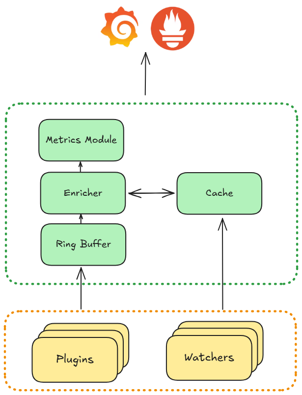

# Architecture

## Overview

In very simple terms, Retina collects metrics from the machine it's running on and hands them over to be processed and visualized elsewhere (in tools such as Prometheus, Hubble UI or Grafana).

To collect this data, Retina observes and hooks on to system events within the kernel through the use of custom eBPF plugins. The data gathered by the plugins is then transformed into `flow` objects and enriched with Kubernetes context, before being converted to metrics and exported.

## Data Plane

This section discusses how Retina collects its raw data. More specifically, it discusses how the eBPF programs and plugins are used.

The plugins have a very specific scope by design, and Retina is designed to be extendable, meaning it is easy to add in additional plugins if necessary. If there is a plugin missing for your use case, you can create your own! See our [Development page](../07-Contributing/02-development.md) for details on how to get started.

The plugins are responsible for installing the eBPF programs into the host kernel during startup. Each plugin has an associated eBPF program. These eBPF programs collect metrics from events in the kernel level, which are then passed to the user space where they are parsed and converted into a `flow` data structure. Depending on the Control Plane being used, the data will either be sent to a Retina Enricher, or written to an external channel which is consumed by a Hubble observer - more on this in the [Control Plane](#control-plane) section below.

Some examlpes of existing Retina plugins:

- Drop Reason - measures the number of packets/bytes dropped and the reason and the direction of the drop.
- DNS - counts DNS requests/responses by query, including error codes, response IPs, and other metadata.
- Packet Forward - measures packets and bytes passing through the eth0 interface of each node, along with the direction of the packets.

You can check out the rest on the [Plugins](../03-Metrics/plugins/readme.md) page.

### Plugin Lifecycle

The Plugin Manager is in charge of starting up all of the plugins, and the Watcher Manager - which in turn starts the watchers. It can also reconcile plugins, which will regenerate the eBPF code and the BPF object.

The lifecycle of a plugins themselves can be summarized as follows:

- Initialize - Initialize eBPF maps. Create sockets / qdiscs / filters etc. Load eBPF programs.
- Start - Read data from eBPF maps and arrays. Send it to the appropriate location depending on the Control Plane.
- Stop - Clean up any resources created and stop any threads.

## Control Plane

This section describes how the collected data from the Data Plane is processed, transformed and used.

Retina currently has two options for the Control Plane:

- [Hubble Control Plane](#hubble-control-plane)
- [Legacy* Control Plane](#legacy-control-plane)

(* The "Legacy" naming will soon be replaced to a more accurate description - [GitHub Issue #1115](https://github.com/microsoft/retina/issues/1115))

| Platform | Default Control Plane  |
|----------|------------------------|
| Windows  | Legacy                 |
| Linux    | Legacy                 |
| Linux - [Advanced Container Networking Services](https://aka.ms/acns)   | Hubble         |

Both Control Planes integrate with the same Data Plane, and have the same contract which is the `flow` data structure. (The `flow` data structure is [defined by Cilium](https://github.com/cilium/cilium/tree/main/api/v1/flow).) Both Control Planes also generate metrics and traces, albeit different metrics are supported by each. See our [Metrics page](../03-Metrics/01-metrics-intro.md) for more information.

Please refer to the [Installation](../02-Installation/01-Setup.md) page for further setup instructions.

### Hubble Control Plane

When the Hubble Control Plane is being used, the data from the plugins is written to an `external channel`. A component called the Monitor Agent monitors this channel, and keeps track of a list of listeners and consumers. One of such consumers is the Hubble Observer. This means that when the Monitor Agent detects an update in the channel it will forward the data to the Hubble Observer.

The Hubble Observer is initialized with a Packet Parser. The parser has an understanding of the data that it receives from the Monitor Agent and it converts this data into basic `flow` structs.

This basic `flow` struct is then enriched with Kubernetes specific context through the use of Cilium libraries (red blocks in the diagram). This includes mapping IP addressses to Kubernetes objects such as Nodes, Pods, Namespaces or Labels. This data comes from the Kubernetes watchers.

Once the data is in consistent `flow` objects, and enriched with Kubernetes context, it gets sent to Hubble. Hubble reads this data from its buffer and converts it to metrics and `flow` logs, which are then served as follows:

- Server 9965 - Hubble metrics (Prometheus)
- Local Server 4244 - Hubble Relay aggregates the data across all nodes in the cluster
- Local Unix Socket - serves node specific data

### Legacy Control Plane

When the Legacy Control Plane is being used, the data from the plugins is written to a custom Enricher component. This component is not initialized when using the Hubble Control Plane, and so the plugins know where to write the data to.

The Enricher keeps a cache of Kubernetes objects and is then able to enrich the `flow` objects with this information. After enrichment, the `flow` objects are exported to an output ring.

The Metrics Module reads the data exported by the Enricher and constructs metrics out of it, which it then exports itself.

