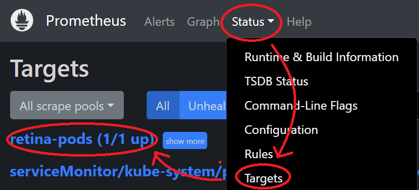
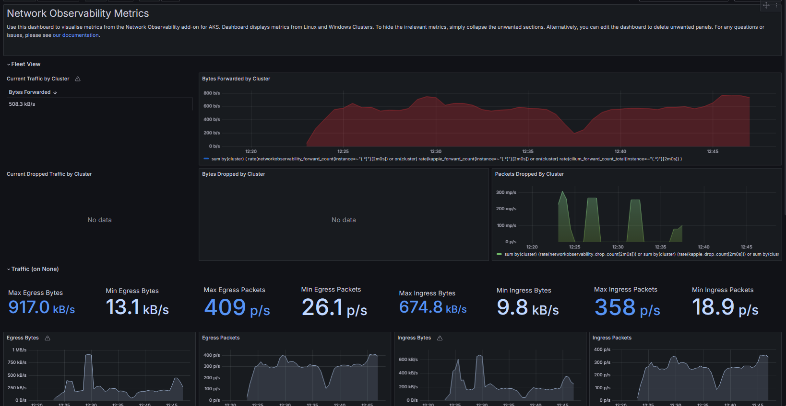

# Unmanaged Prometheus/Grafana
<!-- markdownlint-disable MD029 -->

## Pre-Requisites

1. Create a Kubernetes cluster.
2. Install Retina DaemonSet (see [Quick Installation](../01-Setup.md)).

## Configuring Prometheus

1. In this example, we will install Prometheus via the community supported helm chart. If you already have this chart deployed, skip to step 3.

  ```shell
  helm repo add prometheus-community https://prometheus-community.github.io/helm-charts
  helm repo update
  ```

2. Save **[these Prometheus values](https://github.com/microsoft/retina/blob/main/deploy/legacy/prometheus/values.yaml)** below to `deploy/legacy/prometheus/values.yaml`

3. Install the Prometheus chart

  ```shell
  helm install prometheus -n kube-system -f deploy/prometheus/values.yaml prometheus-community/kube-prometheus-stack
  ```

Or if you already have the chart installed, upgrade how you see fit, providing the new job name as an additional scrape config, ex:

  ```shell
  helm upgrade prometheus -n kube-system -f deploy/prometheus/values.yaml prometheus-community/kube-prometheus-stack
  ```

Note: Grafana and kube-state metrics may schedule on Windows nodes, the current chart doesn't have node affinity for those components. Some manual intervention may be required.

6. Verify that the Retina Pods are being scraped by port-forwarding the Prometheus server:

  ```shell
  kubectl port-forward --namespace kube-system svc/prometheus-operated 9090
  ```

7. Then go to [http://localhost:9090/targets](http://localhost:9090/targets) to see the Retina Pods being discovered and scraped:



## Configuring Grafana

Create a Grafana instance at [grafana.com](https://www.grafana.com) and follow [Configuring Grafana](./grafana.md), or use the one installed from above.

8. Get the Grafana password:

```shell
kubectl get secret -n kube-system prometheus-grafana -o jsonpath="{.data.admin-password}" | base64 --decode ; echo
```

9. Import the new dashboard from **[here](https://grafana.com/grafana/dashboards/18814/)**.

10. Metrics should be visible:


