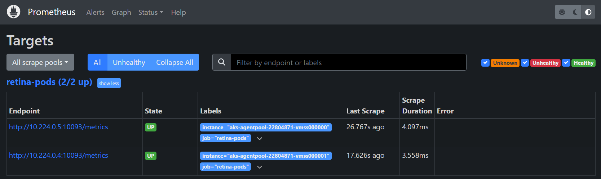

# Configuring Prometheus

Prometheus is an open-source system monitoring and alerting toolkit originally built at SoundCloud. It is now a standalone open source project and maintained independently of any company. Prometheus's main features include a multi-dimensional data model, a flexible query language, efficient time series database, and modern alerting approach. For more information, visit the [Prometheus website](https://prometheus.io).

## Pre-Requisites

1. Create a Kubernetes cluster.
2. Install Retina DaemonSet (see [Quick Installation](./01-Setup.md)).
3. Clone [Retina Repository](https://github.com/microsoft/retina) or download [Prometheus Values File](../../deploy/standard/prometheus/values.yaml).

## Install Prometheus via Helm

1. In this example, we will install Prometheus via the community supported helm chart. If you already have this chart deployed, skip to step 3.

  ```shell
  helm repo add prometheus-community https://prometheus-community.github.io/helm-charts
  helm repo update
  ```

1. Install the Prometheus chart

  ```shell
  CONTROL_PLANE=hubble # or standard
  # The value of VALUE_FILE_PATH is relative to the repo root folder. Update this according to the location of your file.
  VALUE_FILE_PATH=deploy/${CONTROL_PLANE}/prometheus/values.yaml
  helm install prometheus -n kube-system -f $VALUE_FILE_PATH prometheus-community/kube-prometheus-stack
  ```

  Or if you already have the chart installed, upgrade how you see fit, providing the new job name as an additional scrape config, ex:

  ```shell
  # The value of VALUE_FILE_PATH is relative to the repo root folder. Update this according to the location of your file.
  VALUE_FILE_PATH=deploy/standard/prometheus/values.yaml
  helm upgrade prometheus -n kube-system -f $VALUE_FILE_PATH prometheus-community/kube-prometheus-stack
  ```

> Note: Grafana and kube-state metrics may schedule on Windows nodes, the current chart doesn't have node affinity for those components. Some manual intervention may be required.

## Access Prometheus UI

1. Use port forwarding to accees Prometheus UI:

  ```shell
  kubectl port-forward --namespace kube-system svc/prometheus-operated 9090
  ```

1. Go to [localhost:9090/targets](http://localhost:9090/targets) to see the Retina Pods being discovered and scraped by Prometheus



## Next steps

Follow [Configuring Grafana](./05-grafana.md) to visualise metrics in dashboards.
