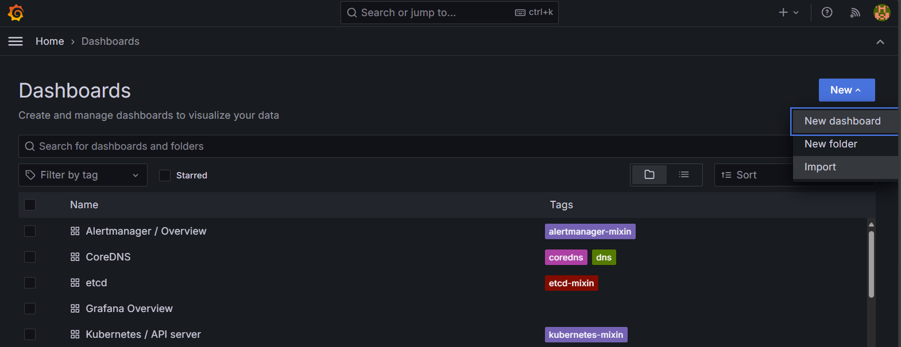

# Grafana

Grafana is an open-source platform for monitoring and observability. It allows you to query, visualize, alert on, and explore your metrics no matter where they are stored. For more information, visit the [Grafana open-source section](https://grafana.com/oss/).

## Pre-Requisites

Make sure that you're still port-forwarding your server to [localhost:9090](http://localhost:9090) as part of [Prometheus](./04-prometheus.md) setup. Alternatively you can configure your server for some other HTTP endpoint, but that is not covered in the following instructions.

## Configuring Grafana

If you followed the steps to install and configure [Prometheus](./04-prometheus.md), you will already have Grafana installed as part of the `kube-prometheus-stack` Helm chart.

1. Get Grafana user

   ```shell
   kubectl get secret -n kube-system prometheus-grafana -o jsonpath="{.data.admin-user}" | base64 --decode ; echo
   ```

2. Get Grafana password

   ```shell
   kubectl get secret -n kube-system prometheus-grafana -o jsonpath="{.data.admin-password}" | base64 --decode ; echo
   ```

3. Use port forwarding to access Grafana UI at [localhost:8080](http://localhost:8080) and enter you login credentials

   ```shell
   kubectl port-forward --namespace kube-system  svc/prometheus-grafana 8080:80
   ```

   

4. Make sure Prometheus is set as a default under Grafana datasources [localhost:8080/connections/datasources](http://localhost:8080/connections/datasources)

   

5. Import the [kubernetes-networking-observability](https://grafana.com/grafana/dashboards/18814/) dashboard by id `18814` at [localhost:8080/dashboard/import](http://localhost:8080/dashboard/import)

   

6. Kubernetes cluster metrics shouold be visible

   

## Retina Dashboards

There is a set of Retina dashboards that you can import directly into Grafana as json files. The dashboards are found under `deploy/legacy/grafana/dashboards/` if you installed retina legacy controlplane, and under `deploy/hubble/grafana/dashboards/` if you installed retina hubble controlplane.

Here is an example of the Retina `dns.json` dashboard.


