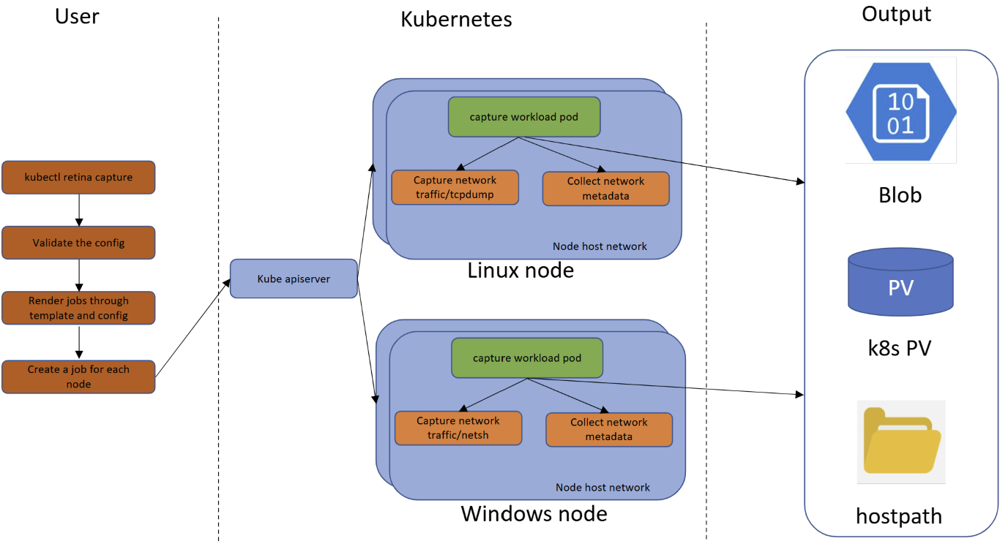

# Capture with Retina CLI

This page describes how the Retina CLI works in the context of performing packet captures.

The use of the Retina CLI to perform captures does **NOT** require the Retina operator pod to be running.

See the [overview](./01-overview.md#capture-jobs) for a description of how the capture jobs are created.



## Prerequisites

- [Install Retina CLI](../02-Installation/02-CLI.md)

## Operations

### Capture Create

`kubectl retina capture create [--flags]` creates a Capture with underlying Kubernetes jobs.

#### Selecting a Target

The target indicates where the packet capture will be performed. This can be set via the following flags:

- `--node-selectors`
- `--node-names`
- `--pod-selectors` and `--namespace-selectors` (pairs)

Note that Node Selectors are not compatible with Pod Selectors & Namespace Selectors pairs and the capture will not go through if all are populated.

If nothing is set, `kubectl retina capture create` will use `--node-selectors` with the default value shown below in [Flags](#flags).

You can find [target selection examples](#target-selection) below.

#### Configuring the Output Location

The output configuration indicates the location where the capture will be stored. At least one location needs to be specified. This can either be the host path on the node, or a remote storage option.

Blob-upload requires a Blob Shared Access Signature (SAS) with the write permission to the storage account container, to create SAS tokens in the Azure portal, please read: [Create SAS Tokens in the Azure Portal](https://learn.microsoft.com/en-us/azure/cognitive-services/translator/document-translation/how-to-guides/create-sas-tokens?tabs=Containers#create-sas-tokens-in-the-azure-portal).

You can find [output configuration examples](#output-configuration) below.

#### Stopping a Capture

The Capture can be stopped in a number of ways:

- In a given time, by the `duration` flag, or when the file reaches the maximum allowed file size defined by the `max-size` flag.
  - When both are specified, the capture will stop whenever **either condition is first met**.
- On demand by [deleting the capture](#capture-delete) before the specified conditions meets.

The network traffic will be uploaded to the specified output location.

#### Flags

| Flag                  | Type       | Default  | Description                                                                 | Notes |
|-----------------------|------------|----------|-----------------------------------------------------------------------------|-------|
| `blob-upload`         | string     | ""       | Blob SAS URL with write permission to upload capture files.                  |       |
| `debug`               | bool       | false    | When debug is true, a customized retina-agent image, determined by the environment variable RETINA_AGENT_IMAGE, is set. |       |
| `duration`            | string     | 1m0s     | Maximum duration of the packet capture - in minutes / seconds.              |       |
| `exclude-filter`      | string     | ""       | A comma-separated list of IP:Port pairs that are excluded from capturing network packets. Supported formats are IP:Port, IP, Port, *:Port, IP:* | Only works on Linux.     |
| `help`                |            |          | Help for create command.                                                     |       |
| `host-path`           | string     | /mnt/retina/captures | Store the capture file in the node's specified host path.                   |       |
| `include-filter`      | string     | ""       | A comma-separated list of IP:Port pairs that are included from capturing network packets. Supported formats are IP:Port, IP, Port, *:Port, IP:* | Only works on Linux.      |
| `include-metadata`    | bool       | true     | Collect static network metadata into the capture file if true.              |       |
| `job-num-limit`       | int        | 0        | The maximum number of jobs which can be created for each capture. The default value 0 indicates no limit. This can be configured by CLI flags for each CLI command, or by a config map consumed by the retina-operator. When creating a job requires job number exceeds this limit, it will fail with prompt like `Error: the number of capture jobs 3 exceeds the limit 2`. |       |
| `max-size`            | int        | 100      | Maximum size of the capture file - in MB               | Only works on Linux.      |
| `name`                | string     | retina-capture | A name for the Retina Capture.                                              |       |
| `namespace`           | string     | default  | Sets the namespace which hosts the capture job and the other Kubernetes resources for a network capture. | Ensure the namespace exists.      |
| `namespace-selectors` | string     | ""       | Capture network captures on pods filtered by the provided namespace selectors. | Pair with `pod-selectors`.      |
| `node-names`          | string     | ""       | A comma-separated list of node names to select nodes on which the network capture will be performed. |       |
| `node-selectors`      | string     | kubernetes.io/os=linux | A comma-separated list of node labels to select nodes on which the network capture will be performed. |       |
| `no-wait`             | bool       | true     | By default, Retina capture CLI will exit before the jobs are completed. If false, the CLI will wait until the jobs are completed and clean up the Kubernetes resources created. |       |
| `packet-size`         | int        | 0        | Limit the packet size in bytes. Packets longer than the defined maximum size will be truncated. The default value 0 indicates no limit. This is beneficial when the user wants to reduce the capture file size or hide customer data due to security concerns. | Only works on Linux.      |
| `pod-selectors`       | string     | ""       | A comma-separated list of pod labels to select pods on which the network capture will be performed. | Pair with `namespace-selectors`.      |
| `pvc`                 | string     | ""       | PersistentVolumeClaim under the specified or default namespace to store capture files. |       |
| `s3-access-key-id`    | string     | ""       | S3 access key id to upload capture files.                                   |       |
| `s3-bucket`           | string     | ""       | Bucket in which to store capture files.                                      |       |
| `s3-endpoint`         | string     | ""       | Endpoint for an S3 compatible storage service. Use this if you are using a custom or private S3 service that requires a specific endpoint. |       |
| `s3-path`             | string     | retina/captures | Prefix path within the S3 bucket where captures will be stored.              |       |
| `s3-region`           | string     | ""       | Region where the S3 compatible bucket is located.                            |       |
| `s3-secret-access-key`| string     | ""       | S3 access secret key to upload capture files.                                |       |
| `interfaces`          | string     | ""       | Comma-separated list of network interfaces to capture on (e.g., "eth0,eth1"). By default, captures are performed on all network interfaces. |       |
| `tcpdump-filter`      | string     | ""       | Raw tcpdump flags. Available tcpdump filters can be found in the [TCPDUMP MAN PAGE](https://www.tcpdump.org/manpages/tcpdump.1.html). This overrides interface selection options when specified. | Only works on Linux. Includes only tcpdump flags, for boolean expressions, please use include/exclude filters.     |

#### Examples

##### Target Selection

Node Selectors

```sh
kubectl retina capture create \
  --name example-node-selectors \
  --node-selectors "kubernetes.io/os=linux"
```

Node Names

```sh
kubectl retina capture create \
  --name example-node-names \
  --node-names "aks-agentpool-26113504-vmss000000,aks-agentpool-26113504-vmss000001"
```

Pod Selectors & Namespace Selectors (Pairs)

```sh
kubectl retina capture create \
  --name example-pod-namespace-selectors \
  --pod-selectors="k8s-app=kube-dns" \
  --namespace-selectors="kubernetes.io/metadata.name=kube-system"
```

##### Interface Selection

Capture on all interfaces (default behavior)

```sh
kubectl retina capture create \
  --name example-all-interfaces \
  --node-selectors "kubernetes.io/os=linux"
```

Capture on specific interfaces

```sh
kubectl retina capture create \
  --name example-specific-interfaces \
  --node-selectors "kubernetes.io/os=linux" \
  --interfaces "eth0,eth1"
```

##### Output Configuration

Host Path

```sh
kubectl retina capture create \
  --name example-host-path \
  --host-path /mnt/retina/example/captures
```

PVC

```sh
kubectl retina capture create \
  --name example-pvc \
  --pvc mypvc
```

Storage Account

```sh
kubectl retina capture create \
  --name example-blob \
  --blob-upload <Blob SAS URL with write permission>
```

AWS S3

```sh
kubectl retina capture create \
  --name example-s3 \
  --s3-bucket "your-bucket-name" \
  --s3-region "eu-central-1" \
  --s3-access-key-id "your-access-key-id" \
  --s3-secret-access-key "your-secret-access-key"
```

S3 Compatible Service (MinIO)

```sh
kubectl retina capture create \
  --name example-minio \
  --s3-bucket "your-bucket-name" \
  --s3-endpoint "https://play.min.io:9000" \
  --s3-access-key-id "your-access-key-id" \
  --s3-secret-access-key "your-secret-access-key"
```

##### Capture Filters

Include / Exclude Filters

```sh
kubectl retina capture create \
  --name example-include-exclude-filters \
  --include-filter="10.224.0.42:80,10.224.0.33:8080" \
  --exclude-filter="10.224.0.26:80,10.224.0.34:8080"
```

Tcpdump Filters

```sh
kubectl retina capture create \
  --name example-tcpdump-filters \
  --tcpdump-filter="udp port 53"
```

### Capture Delete

Deleting the capture job before either of the terminating conditions have been met will stop the capture.

`kubectl retina capture delete --name <string>` deletes a Kubernetes Jobs with the specified Capture name.

Example:

```sh
kubectl retina capture delete --name retina-capture-zlx5v
```

### Capture List

To get a list of the captures you can run `kubectl retina capture list` to get the captures in a specific namespace or in all namespaces.

List by namespace:

```sh
kubectl retina capture list --namespace capture
```

List by all namespaces:

```sh
kubectl retina capture list --all-namespaces
```

### Capture Download

The `kubectl retina capture download` command allows you to download capture files directly from the cluster or from blob storage.

#### Download from Cluster

Download capture files using the capture name:

```sh
kubectl retina capture download --name <capture-name>
```

Download capture files and specify an output location:

```sh
kubectl retina capture download --name <capture-name> -o <output-location>
```

By default, files are downloaded to the current directory.

#### Download from Blob Storage

Download capture files from Azure Blob Storage using a Blob URL (requires Read/List permissions):

```sh
kubectl retina capture download --blob-url "<blob-url>"
```

#### Download Output Structure

The command will create a directory with the capture name and download all related capture files. Each capture file is downloaded as a `.tar.gz` archive with a name pattern matching `$(capturename)-$(hostname)-$(date +%Y%m%d%H%M%S%Z).tar.gz`.

For example:

```bash
/output-directory/
└── capture-name/
    ├── capture-name-node1-20230320013600UTC.tar.gz
    └── capture-name-node2-20230320013600UTC.tar.gz
```

## Obtaining the output

After downloading or copying the tarball from the location specified, extract the tarball through the `tar` command in either Linux shell or Windows Powershell, for example,

```sh
tar -xvf retina-capture-aks-nodepool1-41844487-vmss000000-20230320013600UTC.tar.gz
```

### Name pattern of the tarball

The tarballs take the following name pattern, `$(capturename)-$(hostname)-$(date +%Y%m%d%H%M%S%Z).tar.gz`.

- e.g. `retina-capture-aks-nodepool1-41844487-vmss000000-20230313101436UTC.tar.gz`

### File and directory structure inside the tarball

- Linux

```text
├── ip-resources.txt
├── iptables-rules.txt
├── retina-capture-aks-nodepool1-41844487-vmss000000-20230320013600UTC.pcap
├── proc-net
│   ├── anycast6
│   ├── arp
... ...
├── proc-sys-net
│   ├── bridge
... ...
|-- socket-stats.txt
`-- tcpdump.log
```

- Windows

```text
│   retina-capture-akswin000002-20230322010252UTC.etl
│   retina-capture-akswin000002-20230322010252UTC.pcap
│   netsh.log
│
└───metadata
    │   arp.txt
        ... ...
    │
    ├───adapters
    │       6to4 Adapter_int.txt
            ... ...
    │
    ├───logs
    │   ├───cbs
    │   │       CBS.log
    │   │
    │   ├───dism
    │   │       dism.log
    │   │
    │   └───NetSetup
    │           service.0.etl
                ... ...
    │
    ├───wfp
    │       filters.xml
    │       netevents.xml
    │       wfpstate.xml
    │
    └───winevt
            Application.evtx
            ... ...
```

### Network metadata

- Linux
  - IP address configuration (ip -d -j addr show)
  - IP neighbor status (ip -d -j neighbor show)
  - IPtables rule dumps
    - iptables-save
    - iptables -vnx -L
    - iptables -vnx -L -t nat
    - iptables -vnx -L -t mangle
  - Network statistics information
    - ss -s (summary)
    - ss -tapionume (socket information)
  - networking stats (/proc/net)
  - kernel networking configuration (/proc/sys/net)

- Windows
  - reference: [Microsoft SDN Debug tool](https://github.com/microsoft/SDN/blob/master/Kubernetes/windows/debug/collectlogs.ps1)

## Debug mode

With debug mode, when `--debug` is specified, you can overwrite the capture job's pod image.

Use `ghcr.io` image in default debug mode:

```sh
kubectl retina capture create \
  --name capture-test \
  --host-path /mnt/test \
  --namespace capture \
  --node-selectors "kubernetes.io/os=linux" \
  --debug
```

Use custom retina-agent image by specifying it in the `RETINA_AGENT_IMAGE` environment variable:

```sh
RETINA_AGENT_IMAGE=<YOUR RETINA AGENT IMAGE>
kubectl retina capture create \
  --name capture-test \
  --host-path /mnt/test \
  --namespace capture \
  --node-selectors "kubernetes.io/os=linux" \
  --debug
```

## Cleanup

When creating a capture, you can specify `--no-wait` to clean up the jobs after the Capture is completed.

Otherwise, after creating a Capture, a random Capture name is returned, with which you can delete the jobs by running the `kubectl retina capture delete` command.
