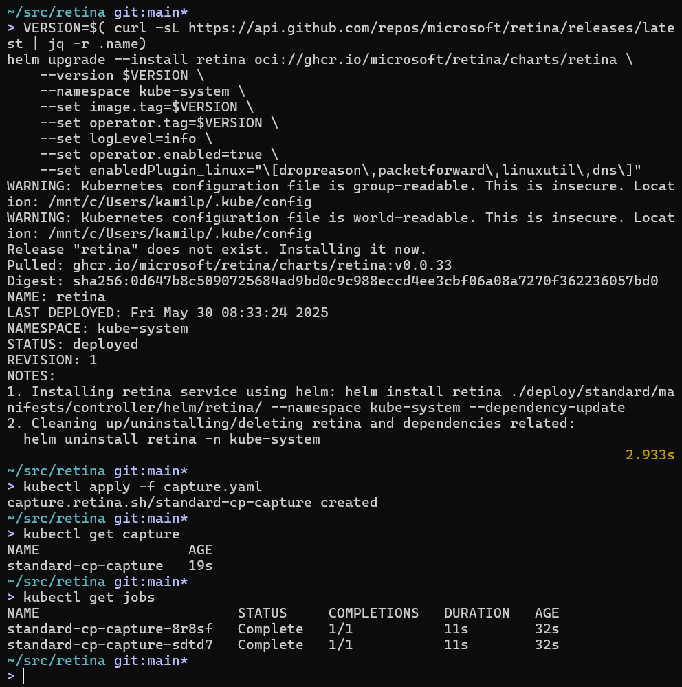

# Capture with CRD

This page describes how the Retina Capture CRD works.

See the [overview](./01-overview.md/#capture-jobs) for a description of how the capture jobs are created.


## Prerequisites

- [Install Retina](../02-Installation/01-Setup.md/#capture-support) **with capture support**.

## Usage

You must create a YAML manifest file with the desired specifications and apply it to the cluster using `kubectl apply`.

- If successful, the capture job should spin up after you apply.
- If not successful, no job will spin up. You can troubleshoot by checking the status of the CRD with `kubectl get capture <capture-crd-name> -o yaml`.

The full specification for the Capture CRD can be found in the [Capture CRD file](https://github.com/microsoft/retina/blob/main/deploy/standard/manifests/controller/helm/retina/crds/retina.sh_captures.yaml).

Refer to the [Capture CRD](../05-Concepts/CRDs/Capture.md) page for more details.



## Examples

Node Selectors and Host Path output target

```yaml
apiVersion: retina.sh/v1alpha1
kind: Capture
metadata:
  name: example-node-selectors
spec:
  captureConfiguration:
    captureOption:
      duration: "5s"
      maxCaptureSize: 100
      packetSize: 1500
    captureTarget:
      nodeSelector:
        matchLabels:
          kubernetes.io/os: linux
  outputConfiguration:
    hostPath: /captures
```

Include / Exclude filters

```yaml
apiVersion: retina.sh/v1alpha1
kind: Capture
metadata:
  name: example-include-exclude-filters
spec:
  captureConfiguration:
    captureOption:
      duration: "5s"
      maxCaptureSize: 100
      packetSize: 1500
    captureTarget:
      nodeSelector:
        matchLabels:
          kubernetes.io/os: linux
    filters:
      include:
        - 10.224.0.42:80
        - 10.224.0.33:8080
      exclude:
        - 10.224.0.26:80
        - 10.224.0.34:8080
  outputConfiguration:
    hostPath: /captures
```

Additional examples can also be found in the [GitHub capture samples](https://github.com/microsoft/retina/tree/main/samples/capture).
