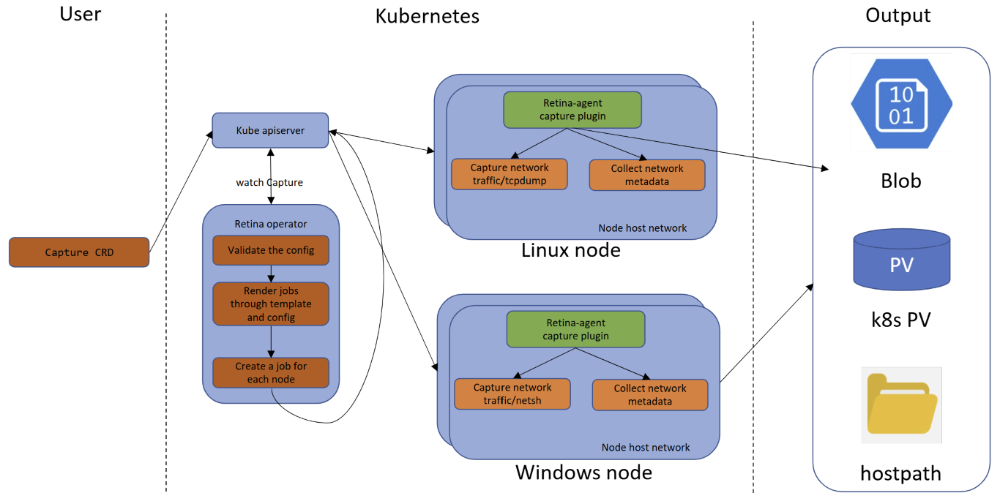

# Capture with CRD

This page describes how the Retina Capture CRD works.

See the [overview](./01-overview.md/#capture-jobs) for a description of how the capture jobs are created.



## Prerequisites

- [Install Retina](../02-Installation/01-Setup.md/#capture-support) **with capture support**.

## Usage

You must create a YAML manifest file with the desired specifications and apply it to the cluster using `kubectl apply`.

- If successful, the capture job should spin up after you apply.
- If not successful, no job will spin up. You can troubleshoot by checking the status of the CRD with `kubectl get capture <capture-crd-name> -o yaml`.

The full specification for the Capture CRD can be found in the [Capture CRD file](https://github.com/microsoft/retina/blob/main/deploy/standard/manifests/controller/helm/retina/crds/retina.sh_captures.yaml).

Refer to the [Capture CRD](../05-Concepts/CRDs/Capture.md) page for more details.

```shell
# Install Retina with Standard Control Plane and Operator enabled
> VERSION=$( curl -sL https://api.github.com/repos/microsoft/retina/releases/latest | jq -r .name)
helm upgrade --install retina oci://ghcr.io/microsoft/retina/charts/retina \
    --version $VERSION \
    --namespace kube-system \
    --set image.tag=$VERSION \
    --set operator.tag=$VERSION \
    --set logLevel=info \
    --set operator.enabled=true \
    --set enabledPlugin_linux="\[dropreason\,packetforward\,linuxutil\,dns\]"

Release "retina" does not exist. Installing it now.
Pulled: ghcr.io/microsoft/retina/charts/retina:v0.0.33
Digest: sha256:0d647b8c5090725684ad9bd0c9c988eccd4ee3cbf06a08a7270f362236057bd0
NAME: retina
LAST DEPLOYED: Fri May 30 09:01:57 2025
NAMESPACE: kube-system
STATUS: deployed
REVISION: 1
NOTES:
1. Installing retina service using helm: helm install retina ./deploy/standard/manifests/controller/helm/retina/ --namespace kube-system --dependency-update
2. Cleaning up/uninstalling/deleting retina and dependencies related:
  helm uninstall retina -n kube-system

# Apply the Capture configuration
> kubectl apply -f capture.yaml
capture.retina.sh/hubble-cp-capture created

# View the jobs which got created
> kubectl get jobs
NAME                        STATUS     COMPLETIONS   DURATION   AGE
standard-cp-capture-8r8sf   Complete   1/1           11s        4m31s
standard-cp-capture-sdtd7   Complete   1/1           11s        4m31s
```

## Examples

Node Selectors and Host Path output target

```yaml
apiVersion: retina.sh/v1alpha1
kind: Capture
metadata:
  name: example-node-selectors
spec:
  captureConfiguration:
    captureOption:
      duration: "5s"
      maxCaptureSize: 100
      packetSize: 1500
    captureTarget:
      nodeSelector:
        matchLabels:
          kubernetes.io/os: linux
  outputConfiguration:
    hostPath: /captures
```

Include / Exclude filters

```yaml
apiVersion: retina.sh/v1alpha1
kind: Capture
metadata:
  name: example-include-exclude-filters
spec:
  captureConfiguration:
    captureOption:
      duration: "5s"
      maxCaptureSize: 100
      packetSize: 1500
    captureTarget:
      nodeSelector:
        matchLabels:
          kubernetes.io/os: linux
    filters:
      include:
        - 10.224.0.42:80
        - 10.224.0.33:8080
      exclude:
        - 10.224.0.26:80
        - 10.224.0.34:8080
  outputConfiguration:
    hostPath: /captures
```

Additional examples can also be found in the [GitHub capture samples](https://github.com/microsoft/retina/tree/main/samples/capture).
