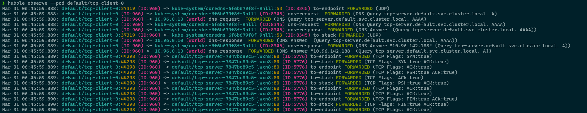

# Hubble CLI

When Retina is [deployed with Hubble control plane](../02-Installation/01-Setup.md#hubble-control-plane), Hubble CLI can be used to analize network flows in realtime.

## Overview

Hubble is a fully distributed networking and security observability platform for cloud native workloads. It is built on top of eBPF to enable deep visibility into the communication and behavior of services as well as the networking infrastructure in a completely transparent manner. Hubble is able to obtain deep visibility into the network traffic of Kubernetes application and services by tapping into Retina eBPF data plane. This information can then be queried via Hubble CLI and UI, for example for interactive troubleshooting of DNS issues.

## Prerequisites

Install Hubble client by following the [instructions on the official Cilium/Hubble documentation](https://docs.cilium.io/en/stable/observability/hubble/setup/#install-the-hubble-client)

Validate installation

```sh
❯ hubble
Hubble is a utility to observe and inspect recent Cilium routed traffic in a cluster.

Usage:
  hubble [command]

Available Commands:
  completion  Generate the autocompletion script for the specified shell
  config      Modify or view hubble config
  help        Help about any command
  list        List Hubble objects
  observe     Observe flows and events of a Hubble server
  status      Display status of Hubble server
  version     Display detailed version information

Global Flags:
      --config string   Optional config file (default "/home/srodi/.config/hubble/config.yaml")
  -D, --debug           Enable debug messages

Get help:
  -h, --help    Help for any command or subcommand

Use "hubble [command] --help" for more information about a command.
```

>Note the message "Hubble is a utility to observe and inspect recent Cilium routed traffic in a cluster." is not entirely correct, since Hubble is also available without Cilium when using Retina. This means Cilium IS NOT necessarily required to leverage Hubble.


## Example

To access the Hubble CLI you will need to port-forward the hubble-relay service. The default port used by Hubble CLI is 4245.

```sh
kubectl port-forward -n kube-system svc/hubble-relay 4245:80
```

Validate hubble is running:

```sh
❯ hubble status
Healthcheck (via localhost:4245): Ok
Current/Max Flows: 4,095/4,095 (100.00%)
Flows/s: 21.28
Connected Nodes: 1/1
```

Observe network flows via Hubble CLI for a test client/server TCP excange.




>Note: for more examples on hubble CLI checkout the official documentation on [cilium/hubble](https://github.com/cilium/hubble?tab=readme-ov-file#flow-visibility)