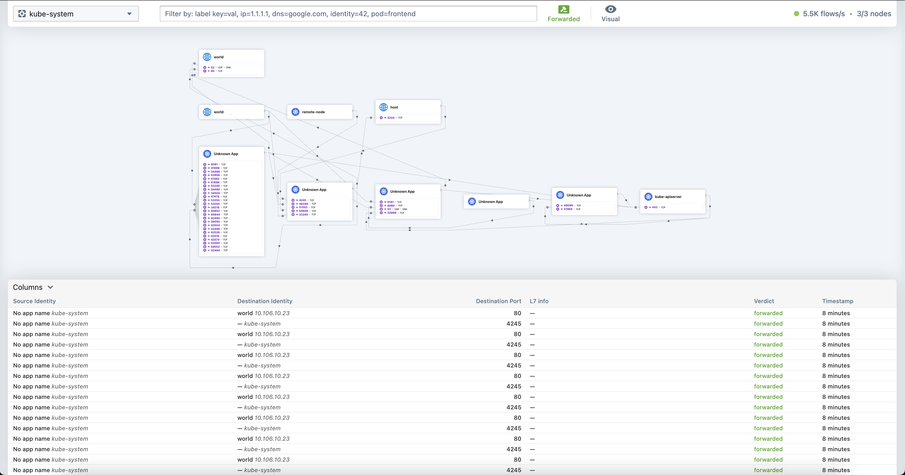

# Hubble UI
When Retina is [deployed with Hubble control plane](../02-Installation/01-Setup.md#hubble-control-plane), Hubble CLI can be used to analize network flows in realtime.

## Introduction
Hubble UI is a web-based interface for visualizing and monitoring network flows captured by Retina. It provides a graphical service map and detailed flow information, making it easier to analyze and troubleshoot network traffic in Kubernetes environments.

We covered the description of Hubble in the overview of [Hubble CLI](01-hubble-cli.md). Both Hubble CLI and UI rely on the same Retina eBPF data plane to provide access to networking obesevability.

## Prerequisites
- A running Kubernetes cluster
- Access to `kubectl` with sufficient permissions
- (Optional) Helm installed for other easier deployment

## Installation Steps
1. **Expose the Hubble UI service:**
   ```bash
   kubectl -n kube-system port-forward svc/hubble-ui 8081:80
   ```
   Hubble UI should now be accessible on [http://localhost:8081](http://localhost:8081)

For more details on other installation options, refer to the [Retina Setup documentation](../02-Installation/01-Setup.md).

## Verify installation
- Open your browser and navigate to [http://localhost:8081](http://localhost:8081).
- You should see the Hubble UI dashboard displaying network flows and a graphical service map.
- If you do not see any flows, ensure that Retina is running and capturing traffic.

    

By selecting a specific namespace and adding the required label-based filtering and/or verdict, you can access the graphical service map and the flows table with detailed information regarding networking traffic for the specific selection.



## Troubleshooting
1. **No flows displayed:**
   - Check that Retina is deployed and running: `kubectl get pods -n kube-system | grep retina`
   - Ensure Hubble Relay is running if required by your setup: `kubectl get pods -n kube-system | grep hubble-relay`
   - Verify network policies and service account permissions
   
2. **Port-forwarding issues:**
   - Ensure no other process is using port 8081: `lsof -i :8081`
   - Try a different local port if needed: `kubectl -n kube-system port-forward svc/hubble-ui 8082:80`
   
3. **UI not loading:**
   - Check pod logs for errors: `kubectl -n kube-system logs deployment/hubble-ui`
   - Ensure all required services are running in the `kube-system` namespace: `kubectl get svc -n kube-system | grep hubble`
   - Verify Hubble UI deployment status: `kubectl get deployment -n kube-system hubble-ui`

4. **Retina installation issues:**
   - Check if the installation completed successfully: `helm status retina -n kube-system`
   - Verify all pods are running: `kubectl get pods -n kube-system -l app.kubernetes.io/name=retina`
   - Check operator logs if installation fails: `kubectl logs -n kube-system -l app=retina-operator`

For more details, refer to the [official Hubble UI documentation](https://docs.cilium.io/en/stable/gettingstarted/hubble_ui/).
