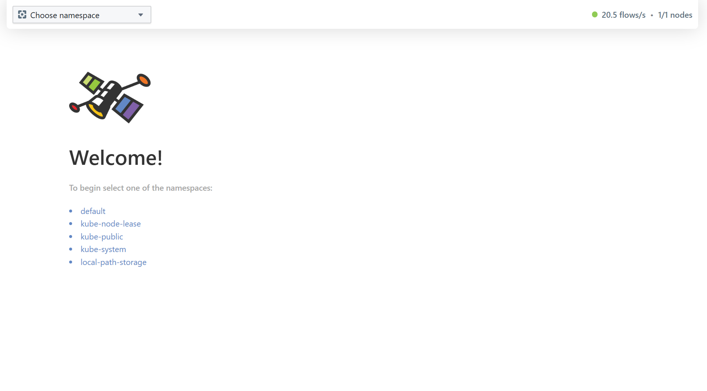
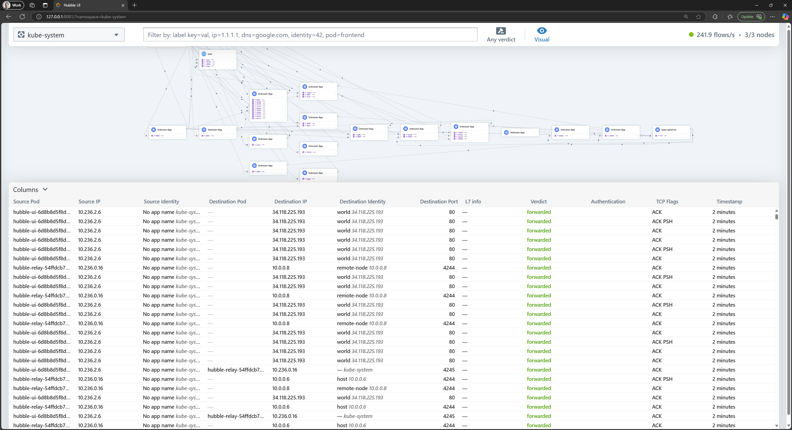

# Hubble UI

When Retina is [deployed with Hubble control plane](../02-Installation/01-Setup.md#hubble-control-plane), Hubble UI provides access to a graphical service map.

## Overview

We covered the description of Hubble in the overview of [Hubble CLI](./01-hubble-cli.md). Both Hubble CLI and UI rely on the same Retina eBPF data plane to provide access to networking obesevability.

## Example

To access Hubble UI from your local machine, port-forward Hubble UI service.

```sh
kubectl port-forward -n kube-system svc/hubble-ui 8081:80
```

Hubble UI should now be accessible on [http://localhost:8081](http://localhost:8081)



By selecting a specific namespace and adding the required label-based filtering and/or verdict, we can access the graphical service map and the flows table with detailed information regarding networking traffic for the specific selection.


