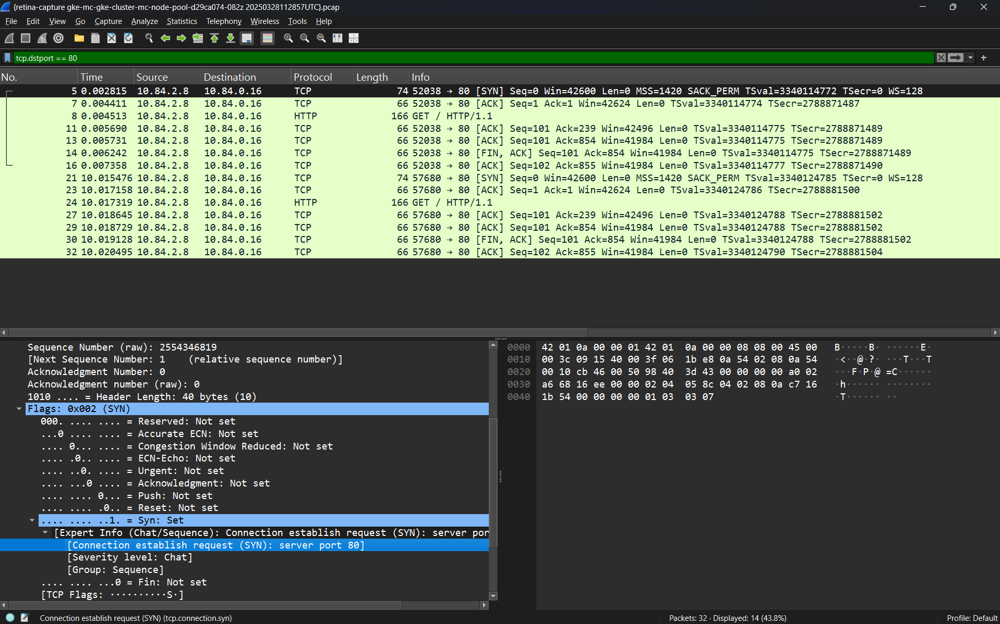

# Wireshark

Retina captures allows you to generate `.pcap` files that can be useful for deep network analysis and visualized in Wireshark.

## Overview

[Wireshark](https://www.wireshark.org/) is a free and open-source packet analyzer used for network troubleshooting, analysis, software and communications protocol development, and education. Wireshark is widely regarded as the most popular network monitoring tool, favored by system administrators, network engineers, security professionals, and even hackers.

## Example

Run a Retina capture on your Kubernetes cluster:

```sh
kubectl retina capture create \
    --host-path /tmp/retina-capture \
    --pod-selectors="app=tcp-client-0" \
    --duration 15s -n default
```

Access the Retina capture tarball depending on your storage option, refer to [Retina capture section](../04-Captures/01-overview.md) for further details.

>Note it is possible to store the output on the node and create a pod with a `hostPath` volume mount. This way we can access the Retina capture by copying the capture file to your local machine via `kubectl cp default/tcp-client-0:${MOUNT_PATH}/${NODE_PATH} ${LOCAL_PATH}`. The team is working on making this feature available in Retina as a single CLI command.

Open the `.pcap` file with Wireshark


