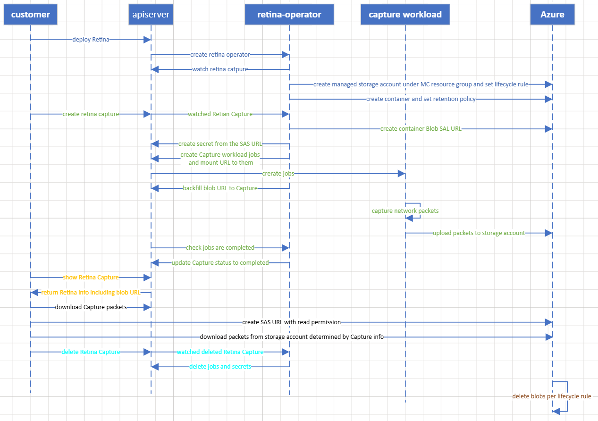

# Managed Storage Account

## Motivation

Retina Capture helps customers capture network packets on Kuberentes cluster to debug network issues. Before Retina Capture can debug the packets, Retina Capture can store the network packets and the customers need to download the packets from Retina Capture supported locations with tools like Wireshark.

To simplify customers' work to decide where to store the packets and then download the packets to local environment, we propose a managed account solution for customer to help customer manage the lifecycle, security when to the storage account and garbage collection of the storage account. Customers can use managed storage account by default, or specify their own storage account ID and Storage Blob Data Owner or higher privilege should be granted to [AKS managed identity or service principal](https://learn.microsoft.com/en-us/azure/aks/use-managed-identity).

## Detailed Design

### Workflow



## Setup

To enable the managed storage account, you need to specify the following configuration in the helm command,

```bash
--set operator.enabled=true \
--set operator.capture.enableManagedStorageAccount=true
```

Internally, `enableManagedStorageAccount` will change the following retina-operator configuration and azure credential config as explained in the following two sections.

### Retina-Operator Configuration

#### enableManagedStorageAccount Configuration

`enableManagedStorageAccount` configuration controls whether to use managed storage account or not.

```yaml
apiVersion: v1
kind: ConfigMap
metadata:
  name: retina-operator-config
  namespace: kube-system
data:
  ... ...
  enableManagedStorageAccount: true/false
  azureCredentialConfig: /etc/kubernetes/cloud-config/azure.json
```

#### Azure credential configuration

The configuration `azureCredentialConfig` in retina-operator-config indicates the Azure credential file path to talk to azure for the managed resources.

```yaml
apiVersion: v1
kind: ConfigMap
metadata:
  name: retina-operator-config
  namespace: kube-system
data:
  .. ...
  enableManagedStorageAccount: true/false
  azureCredentialConfig: /etc/kubernetes/cloud-config/azure.json
```

In the above configuration, when `enableManagedStorageAccount` is true, retina-operator will pick azure credential configuration from `/etc/kubernetes/cloud-config/azure.json`. [retina-operator helm template](https://github.com/microsoft/retina/blob/main/deploy/legacy/manifests/controller/helm/retina/templates/operator.yaml) mounts the secret containing azure credentials to `/etc/kubernetes/cloud-config/azure.json`.

When default storage account is enabled, a managed storage account will be created under the resource group of the sub both specified in the credential file.
In the case of AKS, the resource group will be MC, or node, resource group, and subscription will be the overlay subscription.

#### Azure credential configuration content

Detailed explanation of the auth configuration can be found [here](https://github.com/kubernetes-sigs/cloud-provider-azure/blob/0556803/pkg/azclient/auth_conf.go).

The service principal or managed identity should have `Storage Blob Data Contributor` role to create user delegation SAS, and at least `Storage Account Contributor` role to manage storage account, container and polices in Azure.

- Managed Identity

```json
{
    "cloud": "AzurePublicCloud",
    "tenantId": "<tenant-id>",
    "subscriptionId": "<subscription-id>",
    "aadClientId": "msi",
    "aadClientSecret": "msi",
    "resourceGroup": "<resource-group-name>", // the resource group where the cluster is deployed in
    "location": "<location>", // the location where the cluster is deployed in
    "useManagedIdentityExtension": true,
    "userAssignedIdentityID": "<managed-identity-client-id>",
}
```

- Service Principal

```json
{
    "cloud": "AzurePublicCloud",
    "tenantId": "<tenant-id>",
    "subscriptionId": "<subscription-id>",
    "aadClientId": "<client-id>",
    "aadClientSecret": "<client-secret>",
    "resourceGroup": "<resource-group-name>", // the resource group where the cluster is deployed in
    "location": "<location>", // the location where the cluster is deployed in
    "useManagedIdentityExtension": false,
    "userAssignedIdentityID": "",
}
```

### Storage Account

The storage account, `retina-uuid`, is created under MC resource group and lifecycle management with 7 expiration days is created by Retina Operator if Capture is enabled. AKS customers can enable Retina Capture by upgrading their clusters after this feature is released.

### Container

A container, `capture`, will be created to store the network artifacts after the storage account is ready. And to protect the packets from being deleted or modified, a [retention policy](https://learn.microsoft.com/en-us/azure/storage/blobs/immutable-storage-overview) with 7 days retention period will be applied on this container.

## Create a Retina Capture

Retina-operator will create a container blob SAS URL with expiry time determined from Capture Duration to make sure blob SAS URL is invalid soon after the Capture is completed.
And Retina-operator will update Capture CR with the blob SAL URL to allow the customer read the URL.
