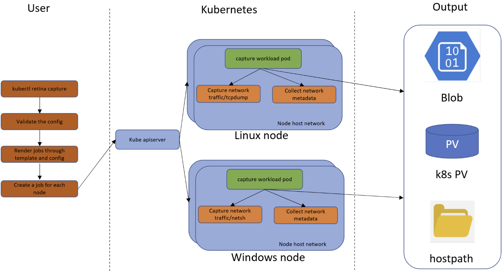
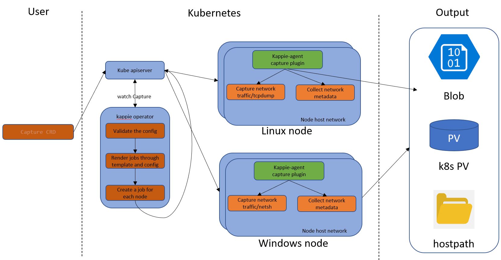

# Captures

## Overview

Retina Capture allows users to capture network traffic/metadata for the specified Nodes/Pods.

Captures are on-demand and can be output to the host filesystem, a storage blob, etc.

## Usage

There are two methods for triggering a Capture:

- [CLI command](#option-1-retina-cli) or
- [CRD/YAML configuration](#option-2-capture-crd-custom-resource-definition).

### Option 1: Retina CLI

Available after [Installing Retina CLI](../installation/cli.md).

See [Capture Command](../captures/cli.md) for more details.

#### Example

This example captures network traffic for all Linux Nodes, storing the output in the folder */mnt/capture* on each Node.

```shell
kubectl-retina capture create --host-path /mnt/capture --node-selectors "kubernetes.io/os=linux"
```

#### Architecture

For each Capture, a Kubernetes Job is created for each relevant Node (the Node could be selected and/or could be hosting a selected Pod).
The Job's worker Pod runs for the specified duration, captures and wraps the network information into a tarball, and copies the tarball to the specified output location(s).
As a special case, a Kubernetes secret will be created containing a storage blob SAS for security concerns, then mounted to the Pod.

A random hashed name is assigned to each Retina Capture to uniquely label it.



### Option 2: Capture CRD (Custom Resource Definition)

Available after after [installing Retina](../installation/setup.md) with capture support.

See [Capture CRD](../CRDs/Capture.md) for more details.

#### Example

This example creates a Capture and stores the Capture artifacts into a storage account specified by Blob SAS URL.

Create a secret to store blob SAS URL:

```yaml
apiVersion: v1
data:
  ## Data key is required to be "blob-upload-url"
  blob-upload-url: <based-encode-blob-sas-url>
kind: Secret
metadata:
  name: blob-sas-url
  namespace: default
type: Opaque
```

Create a Capture specifying the secret created as blobUpload, this example will also store the artifact on the node host path

```yaml
apiVersion: retina.sh/v1alpha1
kind: Capture
metadata:
  name: capture-test
spec:
  captureConfiguration:
    captureOption:
      duration: 30s
    captureTarget:
      nodeSelector:
        matchLabels:
          kubernetes.io/hostname: aks-nodepool1-11396069-vmss000000
  outputConfiguration:
    hostPath: "/tmp/retina"
    blobUpload: blob-sas-url
```

More Retina Capture samples can be found [here](https://github.com/microsoft/retina/tree/main/samples/capture)

#### Architecture

Similarly to Option 1, a Kubernetes Job is created for each relevant Node.


