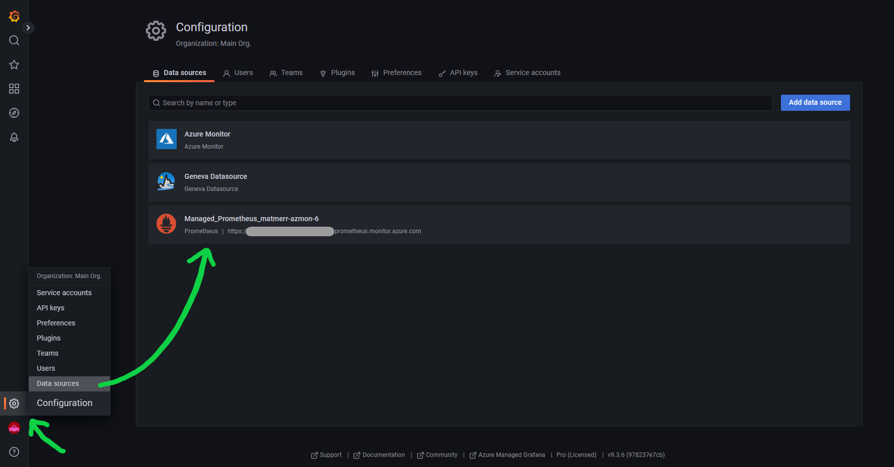
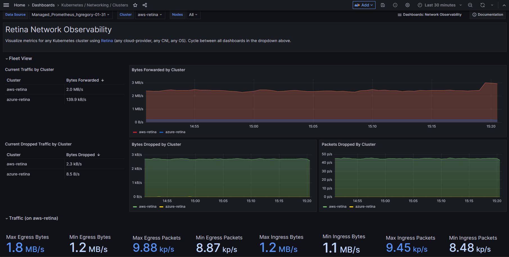

# Configuring Grafana

## Pre-Requisites

- [Unmanaged Prometheus/Grafana](./prometheus-unmanaged.md) or

Make sure that you're still port-forwarding your server to localhost:9090, or configure your server for some other HTTP endpoint.

Port-forward svc/prometheus-grafana to access from local browser.

## Configuration

1. Check Grafana to make sure the managed Prometheus datasource exists:

   

2. Go to the dashboard page and select "import":

   

3. Import the [published dashboards](https://grafana.com/grafana/dashboards/) by ID [18814](https://grafana.com/grafana/dashboards/18814-kubernetes-networking-clusters/)

4. The Grafana dashboard should now be visible.

   

## Pre-Installed Dashboards

ID: [18814](https://grafana.com/grafana/dashboards/18814-kubernetes-networking-clusters/)

If you're using above, versions of these dashbaords are pre-installed under:

- Dashboards > Managed Prometheus > Kubernetes / Networking / Clusters
- Dashboards > Managed Prometheus > Kubernetes / Networking / DNS
