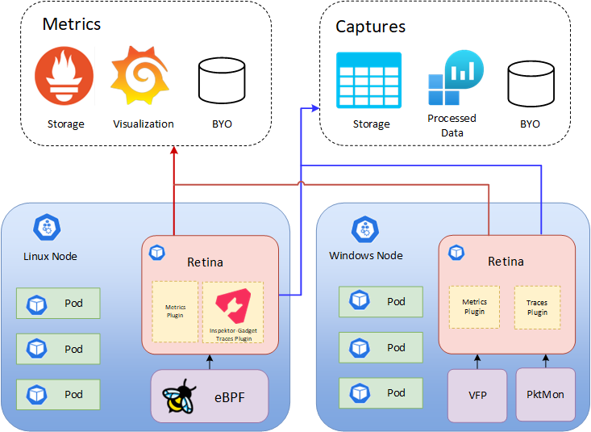

# Introduction to Retina

## What is Retina?

Retina is a cloud-agnostic, open-source **Kubernetes Network Observability platform** which helps with DevOps, SecOps and compliance use cases.
It provides a **centralized hub for monitoring application and network health and security**, catering to Cluster Network Administrators, Cluster Security Administrators and DevOps Engineers.

Retina **collects customizable telemetry**, which can be exported to **multiple storage options** (such as Prometheus, Azure Monitor, and other vendors) and **visualized in a variety of ways** (like Grafana, Azure Log Analytics, and other vendors).

## Features

- **[eBPF](https://ebpf.io/what-is-ebpf#what-is-ebpf)-based** Network Observability platform for Kubernetes workloads.
- **On-Demand** and **Configurable**.
- Actionable, industry-standard **Prometheus metrics**.
- Streamlined **Packet Captures** for deep dives.
- **Cloud-agnostic**, supporting multiple OS (like Linux, Windows, Azure Linux).

## Why Retina?

Retina lets you **investigate network issues on-demand** and **continuously monitor your clusters**. Here are a couple scenarios where Retina shines, minimizing pain points and investigation time.

### Investigations: Debugging Network Connectivity

*Why can't my Pods connect to each other any more?* **Typical investigation is time-intensive** and involves performing packet captures, where one must identify the Nodes involved, gain access to each Node, run `tcpdump` commands, and export the results off of each Node.

With Retina, you can **automate this process** with a **single CLI command** or CRD/YAML that can:
- Run captures on all Nodes hosting the Pods of interest.
- Upload each Node's results to a storage blob.

To begin using the CLI, see [Quick Start Installation](./installation/cli.md).

### Monitoring Network Health

Retina supports actionable insights through **Prometheus** alerting, **Grafana** dashboards, and more. For instance, you can:

- Monitor dropped traffic in a namespace.
- Alert on a spike in production DNS errors.
- Watch changes in API Server latency while testing your application's scale.
- Notify your Security team if a Pod starts sending too much traffic.

## Telemetry

Retina uses two types of telemetry: metrics and captures.

### Metrics

Retina metrics provide **continuous observability** into:
- Incoming/outcoming traffic
- Dropped packets
- TCP/UDP
- DNS
- API Server latency
- Node/interface statistics

Retina provides both:
- **Basic metrics** (default, Node-Level metrics) and
- **Advanced/Pod-Level metrics** (if enabled).

For more info and a list of metrics, see [Metrics](metrics/modes.md).

### Captures

A Retina capture **logs network traffic** and metadata **for the specified Nodes/Pods**.

Captures are **on-demand** and can be output to multiple destinations. For more info, see [Captures](captures/readme.md).

## Extendable Architecture

Retina supports **several options for storage and insights/visualization**. Below is the high-level architecture for Retina, conveying some of these options.

