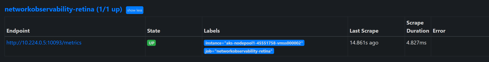

# Basic Metrics TSG

## Overview

Basic metrics is covered by the [Metrics](../metrics/basic.md) section of the Retina documentation. This guide is intended to help you troubleshoot issues with basic metrics.

## Metrics are not being generated or showing up in Grafana dashboards

If you are not seeing metrics in Grafana, it is likely that the metrics are not being generated. To troubleshoot this issue, you can check the following:

### Check Retina pods are running

Check that all Retina pods are running. You can do this by running the following command:

```shell
kubectl get pods -n kube-system -l k8s-app=retina
```

If any of the pods are not running, you can describe the Pod to see what the issue is. You can do this by running the following command:

```shell
kubectl describe pod -n kube-system <retina pod name>
```

### Check Retina Pod Logs

If retina pods are running, you can check the logs for the Pod to see what the issue is. You can do this by running the following command:

```shell
kubectl logs -n kube-system <retina pod name>
```

you should see log lines like the following:

```shell
2023-04-15T23:52:08.046Z        info    dropreason      dropreason/dropreason_linux.go:208      DropReason data collection complete
2023-04-16T00:10:55.598Z        info    linuxutil       linuxutil/linuxutil.go:100      Updated ethTool metrics
```

If you don't see the log lines, then the plugin is not running correctly.

### Check Retina ConfigMap

Please check `retina-config` ConfigMap and make sure the plugins is enabled.

```shell
kubectl get configmap retina-config -n kube-system -oyaml
```

```yaml
apiVersion: v1
data:
  config.yaml: |-
    apiServer:
      host: 0.0.0.0
      port: 10093
    logLevel: info
    enabledPlugin: ["dropreason","packetforward","linuxutil"]
    metricsInterval: 10
    enableTelemetry: false
kind: ConfigMap
metadata:
  annotations:
    meta.helm.sh/release-name: retina
    meta.helm.sh/release-namespace: kube-system
  creationTimestamp: "2023-04-13T21:56:08Z"
  labels:
    app.kubernetes.io/managed-by: Helm
  name: retina-config
  namespace: kube-system
  resourceVersion: "427462"
  uid: 1d45f43a-2db5-4f93-a467-aca106ac3fcb
  ```

### Check Retina Metrics are being generated

You can check that metrics are being generated by calling the metrics endpoint. You can do this by running the following command from inside one of the nodes:

```shell
curl http://<retina-pod-ip>:10093/metrics | grep -i retina
```

You should see metrics like the following:

```shell
# HELP retina_forward_bytes Total forwarded bytes
# TYPE retina_forward_bytes gauge
retina_forward_bytes{direction="egress"} 1.9064666952e+10
retina_forward_bytes{direction="ingress"} 2.3619602627e+10
# HELP retina_forward_count Total forwarded packets
# TYPE retina_forward_count gauge
retina_forward_count{direction="egress"} 4.3139614e+07
retina_forward_count{direction="ingress"} 3.7254085e+07
# HELP retina_interface_stats Interface Statistics
# TYPE retina_interface_stats gauge
retina_interface_stats{interface_name="eth0",statistic_name="vf_rx_bytes"} 1.2679472174e+10
retina_interface_stats{interface_name="eth0",statistic_name="vf_rx_packets"} 1.2948929e+07
# HELP retina_ip_connection_stats IP connections Statistics
# TYPE retina_ip_connection_stats gauge
retina_ip_connection_stats{statistic_name="InECT0Pkts"} 34713
retina_ip_connection_stats{statistic_name="InNoECTPkts"} 3.8893357e+07
retina_ip_connection_stats{statistic_name="InOctets"} 1.6718610902e+10
retina_ip_connection_stats{statistic_name="OutOctets"} 2.7768258214e+10
# HELP retina_tcp_connection_remote number of active TCP connections by remote address
# TYPE retina_tcp_connection_remote gauge
retina_tcp_connection_remote{address="0.0.0.0",port="0"} 8
retina_tcp_connection_remote{address="10.0.0.1",port="443"} 1
retina_tcp_connection_remote{address="10.224.0.105",port="7070"} 1
# HELP retina_tcp_connection_stats TCP connections Statistics
# TYPE retina_tcp_connection_stats gauge
retina_tcp_connection_stats{statistic_name="DelayedACKLocked"} 107
# HELP retina_tcp_state number of active TCP connections by state
# TYPE retina_tcp_state gauge
retina_tcp_state{state="CLOSE_WAIT"} 1
retina_tcp_state{state="ESTABLISHED"} 16
retina_tcp_state{state="FIN_WAIT1"} 1
retina_tcp_state{state="FIN_WAIT2"} 1
retina_tcp_state{state="LAST_ACK"} 1
retina_tcp_state{state="LISTEN"} 8
retina_tcp_state{state="SYN_SENT"} 1
retina_tcp_state{state="TIME_WAIT"} 89
# HELP retina_udp_connection_stats UDP connections Statistics
# TYPE retina_udp_connection_stats gauge
retina_udp_connection_stats{statistic_name="ACTIVE"} 5
```

If you are not seeing metrics like the above, then the plugin is not running correctly. Please check retina config map and make sure the plugins is enabled.

### Check if Managed Prometheus is scraping Retina metrics

If you are using managed Prometheus, you can check if it is scraping the retina metrics by following below steps.

1. Check if AMA metrics pods are running

    ```shell
    kubectl get pods -n kube-system -l dsName=ama-metrics-node
    ```

2. If the AMA metrics pods are running, port forward one of them to check if it can identify the Retina agent pod on the same node.

    ```shell
    kubectl port-forward -n kube-system <ama-metrics-pod-name> 9090:9090
    ```

3. Open the URL below in your browser to check if the AMA pod is targeting the Retina agent pod.

    ```shell
    http://localhost:9090/targets
    ```

    

4. Verify if service discovery is detecting the Retina agent pod.

    ```shell
    http://localhost:9090/service-discovery
    ```

    
    

5. If the Retina agent pod is not discovered, check the Prometheus configuration and ensure the Retina pod's scrape job is included in the scrape config.

    ```shell
    http://localhost:9090/config
    ```

    

6. If the Retina pod's scrape job is missing in the Prometheus config, check the ama-metrics-node config map for the presence of this job or the relevant setting.

    ```shell
    kubectl get configmap ama-metrics-prometheus-config-node -n kube-system -oyaml
    ```
