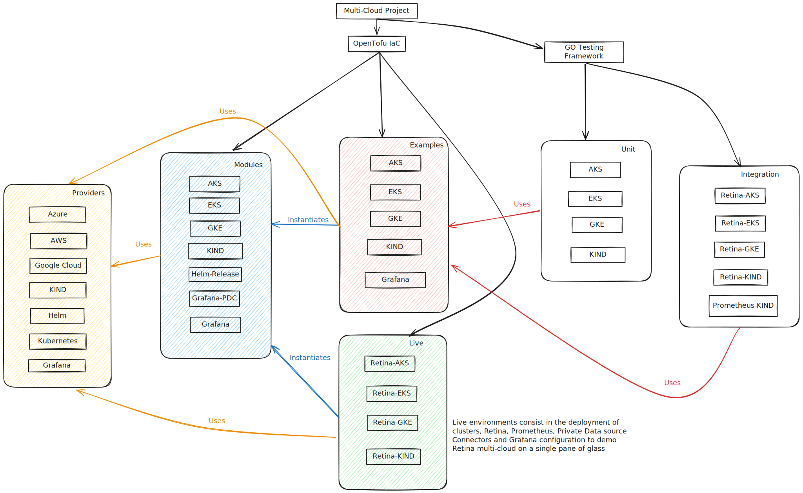

# Multi Cloud Retina

This project leverages [OpenTofu](https://opentofu.org/docs/intro/) Infrastructure as Code (IaC) to create Kubernetes infrastructure on multi-cloud and deploy [microsoft/retina](https://github.com/microsoft/retina) via Helm provider.



## Modules available

* [aks](./modules/aks/)
* [gke](./modules/gke/)
* [kind](./modules/kind/)
* [retina](./modules/retina/)

## Prerequisites

* [OpenTofu installation guide](https://opentofu.org/docs/intro/install/)

* AKS:

    1. create an Azure account
    2. [Install az](https://learn.microsoft.com/en-us/cli/azure/install-azure-cli)

    To deploy an AKS cluster and install retina, create file `live/retina-aks/terraform.tfvars` with the Azure TenantID and SubscriptionID

    ```sh
    # example values
    subscription_id     = "d6050d84-e4dd-463d-afc7-a6ab3dc33ab7"
    tenant_id           = "ac8a4ccd-35f1-4f95-a688-f68e3d89adfc"
    ```

* GKE:

    1. create a gcloud account, project and enable billing
    2. create a service account and service account key
    3. [Enable Kubernetes Engine API](https://console.developers.google.com/apis/api/container.googleapis.com/overview?project=mc-retina)
    4. [Install gcloud](https://cloud.google.com/sdk/docs/install)

    To deploy a GKE cluster export `GOOGLE_APPLICATION_CREDENTIALS` env variable to point to the path where your [service account key](https://cloud.google.com/iam/docs/keys-create-delete) is located.

    ```sh
    # example
    export GOOGLE_APPLICATION_CREDENTIALS=/Users/srodi/src/retina/test/multicloud/live/retina-gke/service-key.json
    ```

* Kind:

    1. Docker installed on the host machine

## Quickstart

The following Make targets can be used to manage each stack lifecycle.

### Create

Format code, initialize OpenTofu, plan and apply the stack to create infra and deploy retina

* AKS:

    ```sh
    make aks
    ```

* GKE:

    ```sh
    make gke
    ```

* Kind:

    ```sh
    make kind
    ```

### Clean up

To destroy the cluster specify the `STACK_NAME` and run `make clean`.

```sh
# destroy AKS and cleanup local state files
# set a different stack as needed (i.e. retina-gke, retina-kind)
export STACK_NAME=retina-aks
make clean
```

### Test

The test framework is levergaing Go and [Terratest](https://terratest.gruntwork.io/docs/). To run tests:

```sh
make test
```

## Providers references

* [GKE resource documentation](https://registry.terraform.io/providers/hashicorp/google/latest/docs/resources/container_cluster)
* [AKS resource documentation](https://registry.terraform.io/providers/hashicorp/azurerm/latest/docs/resources/kubernetes_cluster)
* [Kind resource documentation](https://registry.terraform.io/providers/tehcyx/kind/latest/docs/resources/cluster)


## Troubleshooting

In case the test fails due to timeout, validate the resource was created by the provider, and if it is, you can import into OpenTofu state.

Here is an example on how to import resources for `modules/gke`

```sh
# move to the stack directory
# i.e. examples/gke
tofu import module.gke.google_container_cluster.gke europe-west2/test-gke-cluster
tofu import module.gke.google_service_account.default projects/mc-retina/serviceAccounts/test-gke-service-account@mc-retina.iam.gserviceaccount.com
```

>Note: each resource documentation contains a section on how to import resources into the State. [Example for google_container_cluster resource](https://registry.terraform.io/providers/hashicorp/google/latest/docs/resources/container_cluster#import)
