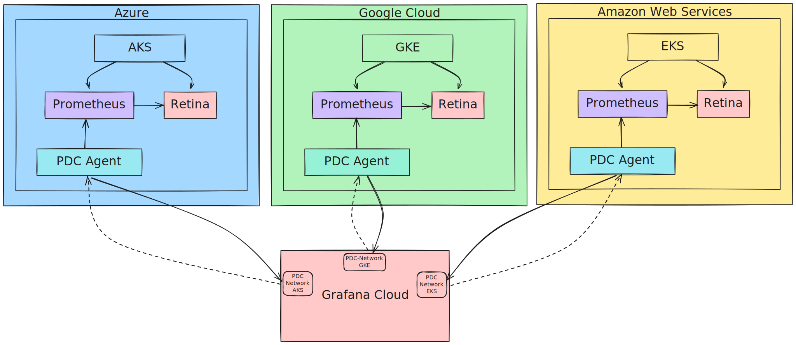

# Multi Cloud Retina

This project leverages [OpenTofu](https://opentofu.org/docs/intro/) Infrastructure as Code (IaC) to create Kubernetes infrastructure on multi-cloud and deploy [microsoft/retina](https://github.com/microsoft/retina) via Helm provider.


An example Hubble UI visualization on GKE dataplane v1 (no Cilium). [See GKE network overview doc](https://cloud.google.com/kubernetes-engine/docs/concepts/network-overview).

## Modules available

* [aks](./modules/aks/): Deploy Azure Kubernetes Service cluster.
* [gke](./modules/gke/): Deploy Google Kubernetes Engine cluster.
* [eks](./modules/eks/): Deploy Elastic Kubernetes Service cluster.
* [kind](./modules/kind/): Deploy KIND cluster.
* [helm-release](./modules/helm-release/): Deploy a Helm Chart, used to deploy Retina and Prometheus.
* [kubernetes-lb](./modules/kubernetes-lb/): Create a Kubernetes Service of type Load Balancer, used to expose Prometheus.
* [grafana](./modules/grafana/): Set up multiple Prometheus data sources in Grafana Cloud.
* [aks-nsg](./modules/aks-nsg/): Inboud and outbount rules for AKS Load Balancer.
* [gke-firewall](./modules/gke-firewall/): Inboud and outbount rules for GKE Load Balancer.

## Prerequisites

* [OpenTofu installation guide](https://opentofu.org/docs/intro/install/)

* AKS:

    1. Create an Azure account.
    2. [Install az](https://learn.microsoft.com/en-us/cli/azure/install-azure-cli).

    To deploy an AKS cluster and install retina, create file `live/retina-aks/terraform.tfvars` with the Azure TenantID and SubscriptionID.

    ```sh
    # example values
    subscription_id     = "d6050d84-e4dd-463d-afc7-a6ab3dc33ab7"
    tenant_id           = "ac8a4ccd-35f1-4f95-a688-f68e3d89adfc"
    ```

* GKE:

    1. create a gcloud account, project and enable billing.
    2. create a service account and service account key.
    3. [Enable Kubernetes Engine API](https://console.developers.google.com/apis/api/container.googleapis.com/overview?project=mc-retina).
    4. [Install gcloud](https://cloud.google.com/sdk/docs/install).

    To deploy a GKE cluster export `GOOGLE_APPLICATION_CREDENTIALS` env variable to point to the path where your [service account key](https://cloud.google.com/iam/docs/keys-create-delete) is located.

    ```sh
    # example
    export GOOGLE_APPLICATION_CREDENTIALS=/Users/srodi/src/retina/test/multicloud/live/retina-gke/service-key.json
    ```

* EKS:
    1. Create an AWS account
    2. Create a user and assign required policies to create VPC, Subnets, Security Groups, IAM roles, EKS and workers
    3. [Install AWS CLI](https://docs.aws.amazon.com/cli/latest/userguide/getting-started-install.html)
    4. Create required `AWS_ACCESS_KEY_ID` and `AWS_SECRET_ACCESS_KEY` for the new user

    To deploy an EKS cluster export `AWS_ACCESS_KEY_ID` and `AWS_SECRET_ACCESS_KEY` as env variables.

    ```sh
    export AWS_ACCESS_KEY_ID="..."
    export AWS_SECRET_ACCESS_KEY="..."
    ```

* Grafana

    1. Set up a [Grafana Cloud free account](https://grafana.com/pricing/) and start an instance.
    2. Create a [Service Account](https://grafana.com/docs/grafana/latest/administration/service-accounts/#create-a-service-account-in-grafana).
    3. Export `GRAFANA_AUTH` environmnet variable containing the service account token.

    ```sh
    # example
    export GRAFANA_AUTH=glsa_s0MeRan0mS7r1ng_1ab2c345
    ```

* Kind:

    1. Docker installed on the host machine

## Quickstart


The following Make targets can be used to manage each stack lifecycle.

### Create

Format code, initialize OpenTofu, plan and apply the stack to create infra and deploy retina

* AKS:

    ```sh
    make aks
    ```

* GKE:

    ```sh
    make gke
    ```

* EKS:

    ```sh
    make eks
    ```

* Kind:

    ```sh
    make kind
    ```

### Clean up

To destroy the cluster specify the `STACK_NAME` and run `make destroy`.

```sh
# destroy AKS and cleanup local state files
# set a different stack as needed (i.e. retina-gke, retina-kind)
export STACK_NAME=retina-aks
make destroy
```

### Test

The test framework is levergaing Go and [Terratest](https://terratest.gruntwork.io/docs/). To run tests:

```sh
make test
```

## Providers references

Resources documentation:

* [GKE](https://registry.terraform.io/providers/hashicorp/google/latest/docs/resources/container_cluster)
* [AKS](https://registry.terraform.io/providers/hashicorp/azurerm/latest/docs/resources/kubernetes_cluster)
* [EKS](https://registry.terraform.io/providers/hashicorp/aws/latest/docs/resources/eks_cluster)
* [Kind](https://registry.terraform.io/providers/tehcyx/kind/latest/docs/resources/cluster)
* [Helm Release](https://registry.terraform.io/providers/hashicorp/helm/latest/docs/resources/release)
* [Kubernetes LB Service](https://registry.terraform.io/providers/hashicorp/kubernetes/latest/docs/resources/service)
* [Grafana Data Source](https://registry.terraform.io/providers/grafana/grafana/latest/docs/resources/data_source)

## Troubleshooting

In case the test fails due to timeout, validate the resource was created by the provider, and if it is, you can import into OpenTofu state.

Here is an example on how to import resources for `modules/gke`:

```sh
# move to the stack directory
# i.e. examples/gke
tofu import module.gke.google_container_cluster.gke europe-west2/test-gke-cluster
tofu import module.gke.google_service_account.default projects/mc-retina/serviceAccounts/test-gke-service-account@mc-retina.iam.gserviceaccount.com

# i.e. examples/eks
tofu import module.eks.aws_eks_node_group.node_group mc-test-aks:mc-test-node-group
tofu import module.eks.aws_iam_role.eks_node_group_role mc-test-eks-node-group-role
tofu import module.eks.aws_iam_role_policy_attachment.eks_node_group_AmazonEKS_CNI_Policy "mc-test-eks-node-group-role/arn:aws:iam::aws:policy/AmazonEKS_CNI_Policy"
tofu import module.eks.aws_iam_role_policy_attachment.eks_node_group_AmazonEKSWorkerNodePolicy "mc-test-eks-node-group-role/arn:aws:iam::aws:policy/AmazonEKSWorkerNodePolicy"
```

>Note: each resource documentation contains a section on how to import resources into the State. [Example for google_container_cluster resource](https://registry.terraform.io/providers/hashicorp/google/latest/docs/resources/container_cluster#import).

## Multi-Cloud

The [live/](./live/) directory contains multi-cloud / multi-cluster stacks to deploy cloud infrastructure, install Retina, install Prometheus, expose Prometheus instance using a load balancer, and configure a Grafana Cloud instance to consume Prometheus data sources to visualize Retina metrics from multiple clusters in a single Grafana dashboard.


